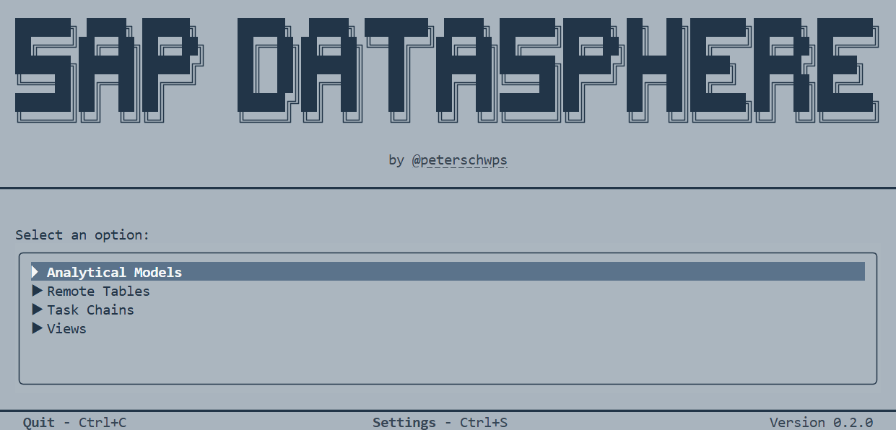
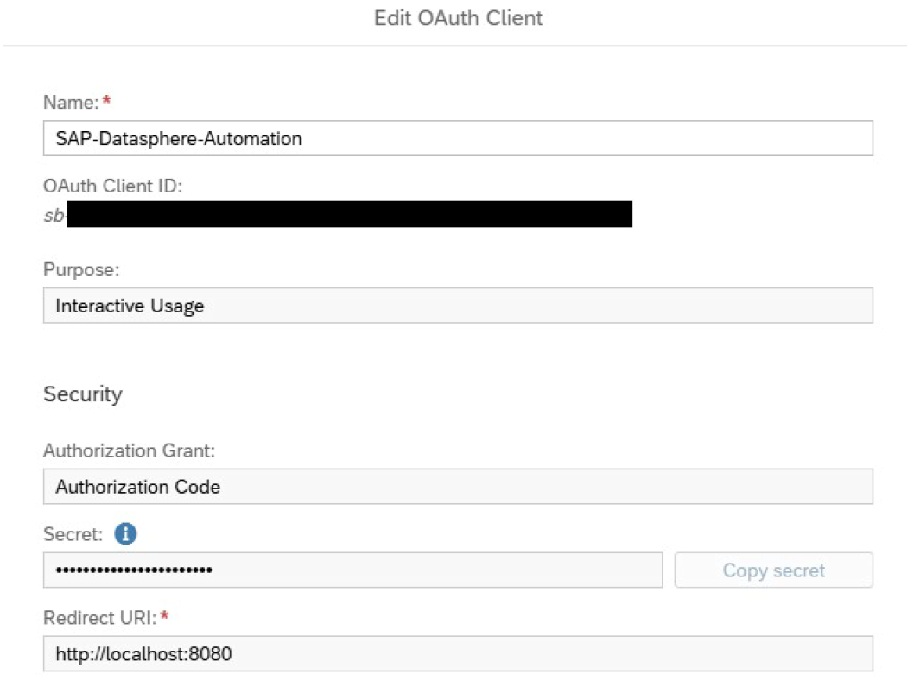

# SAP-Datasphere-CLI

[](https://pypi.org/project/Datasphere-CLI/)
[](https://pypi.org/project/Datasphere-CLI/)
[](https://github.com/peterschwps/SAP-Datasphere-CLI/actions/workflows/ci.yml)
[](LICENSE.txt)

An interactive CLI that uses the internal SAP Datasphere API to automate
various tasks such as managing analytical models, remote tables, task chains
and views.



## Table of Contents

- [Overview](#overview)
- [Features](#features)
- [Prerequisites](#prerequisites)
- [Installation](#installation)
- [Configuration](#configuration)
- [Usage](#usage)
- [Detailed Function Overview](#detailed-function-overview)
- [Development](#development)
- [Notes](#notes)
- [Disclaimer](#disclaimer)

## Overview

This program enables the automation of recurring tasks in SAP Datasphere. It
provides scripts for managing:

- Analytical Models
- Remote Tables
- Task Chains
- Views

## Features

### Analytical Models

- Get analytical-model dependencies and their views
- Measure analytical-model view persistence
- Measure persistence for all views of analytical models

### Remote Tables

- Create statistics (Record Count, Simple Statistics, Histogram)
- Refresh existing statistics

### Task Chains

- Run task chains

### Views

- Find views reaching at least a minimum persistence score
- Find views with an attribute containing a specific substring
- Create partitions by year
- Remove partitions
- Lock partitions up to a specific year
- Unlock partitions
- Persist views
- Unpersist views

## Prerequisites

- **Python**: Version 3.12 or newer
- **Package Installer**: [uv](https://docs.astral.sh/uv/) or [pipx](https://pipx.pypa.io/stable/)

## Installation

### Quick Start

1. Install the CLI as a tool with [uv](https://docs.astral.sh/uv/):

    ```bash
    uv tool install datasphere-cli
    ```

    **or** with [pipx](https://pipx.pypa.io/stable/):

    ```bash
    pipx install datasphere-cli
    ```

2. Run it from the terminal:

    ```bash
    datasphere
    ```

Update to the latest release with `uv tool upgrade datasphere-cli`
 / `pipx upgrade datasphere-cli`.

----

### Shared Command Layer

`datasphere-core` is the shared, presentation-independent command layer used by
the CLI and Datasphere-MCP. It contains typed commands, batch orchestration,
bounded concurrency, progress handling, and shared local session handling. It
can be installed without Textual or Rich:

```bash
pip install datasphere-core
```

Every command is a plain async function taking a `CommandContext` and a typed
request:

```python
from datasphere_core import CommandContext
from datasphere_core.commands.views import persist_view_batch
from datasphere_core.models.views import PersistViewBatchRequest, PersistViewRequest

result = await persist_view_batch(
    CommandContext(client=session.client),
    PersistViewBatchRequest(
        requests=(PersistViewRequest(view="V_SALES", space="DEV"),),
        max_concurrency=4,
    ),
)
print(result.summary)
```

See [docs/datasphere-core-execution.md](docs/datasphere-core-execution.md) for
the execution model, progress callbacks, and the error contract.

The full `datasphere-cli` package includes the TUI and uses this shared layer.

### Direct Commands

Providing no arguments opens the TUI. The canonical direct task-chain command
is:

```bash
datasphere task-chains run TC_TEST_DEV --space DEV
datasphere task-chains run TC_TEST_DEV --space DEV --timeout 600
datasphere task-chains run TC_TEST_DEV --space DEV --output json
```

The task-chain command waits for the terminal SAP status. It exits with code
zero only when the run completes successfully. JSON output is written only to
`stdout`; errors are written to `stderr`.

----

### Install from Git (all platforms)

1. Clone the repository:

    ```bash
    git clone https://github.com/peterschwps/SAP-Datasphere-CLI.git
    cd SAP-Datasphere-CLI
    ```

2. Install with uv (recommended):

    ```bash
    uv sync --all-packages
    ```

3. Install the required browsers for Playwright:

    ```bash
    uv run playwright install chrome msedge
    ```

    Docs: <https://playwright.dev/docs/intro>.

### For Developers

See [Developer Setup](docs/SETUP.md) for development dependencies, Git hooks,
browser installation, and validation commands.

## Configuration

The configuration is quite similar to the
[official SAP Datasphere CLI](Configuration). In Datasphere you need to create
an [OAuth Client for Interactive Usage](https://help.sap.com/docs/SAP_DATASPHERE/c8a54ee704e94e15926551293243fd1d/3f92b46fe0314e8ba60720e409c219fc.html).
This client will be used to authenticate and execute commands on SAP
Datasphere. The full configuration of the settings file (`settings.toml`) is
described down below.

> [!IMPORTANT]
> Please set the **Redirect URI** to `http://localhost:8080` when creating the
OAuth Client. This is the default port that the CLI listens on to retrieve the
callback code.

**This is how your OAuth Client should look like:**



### Creating settings.toml

In order to create the settings file you need to run the CLI once. This will
create a `settings.toml` in your user configuration directory:

- **macOS**: `~/Library/Application Support/Datasphere/settings.toml`
- **Linux**: `~/.config/Datasphere/settings.toml`
- **Windows**: `%LOCALAPPDATA%\Datasphere\settings.toml`

> [!NOTE]
> Version 0.4.0 replaced the previous `settings.ini` with a validated
> `settings.toml`. If you are upgrading, run the CLI once and copy your
> values into the new file.

### Configuring settings.toml

Open the `settings.toml` file and configure the following settings:

```toml
[setup]
# Your SAP Datasphere URL
# (System > Administration > Tenant Links: SAP Datasphere URL)
datasphere_url = "https://example.eu10.hcs.cloud.sap"

# The Authorization URL for OAuth Clients
# (System > Administration > App Integration: Authorization URL)
authorization_url = "https://example.authentication.eu10.hana.ondemand.com/oauth/authorize"

# The Token URL for OAuth Clients
# (System > Administration > App Integration: Token URL)
token_url = "https://example.authentication.eu10.hana.ondemand.com/oauth/token"

# Browser to use for the initial authentication: 'CHROME' or 'EDGE'
browser_to_use = "EDGE"

[credentials]
# OAuth Client ID of your Configured Client
# (System > Administration > App Integration: Configured Clients)
client_id = ""

# Secret of your Configured Client
# Must be provided here or with the environment variable 'SECRET'.
secret = ""
```

## Usage

### Execution

Run it from the terminal:

```bash
datasphere
```

### First Run / Expired Tokens

On first execution (or if your refresh token has expired), the CLI will open a
browser window. After logging in the site will automatically redirect to
`http://localhost:8080`, fetch the callback code and close the browser window.

This will create a login session which can be refreshed automatically in the
future. The session tokens are stored as `session.json` in the user data
directory of `Datasphere`, so other tools built on the
[Datasphere-API](https://github.com/peterschwps/SAP-Datasphere-API) library
can share the same session.

### Menu Navigation

The program starts with an interactive menu:

1. Select a category
2. Choose a function
3. Enter the required parameters
4. Optionally select the number of threads for parallel execution

### Directory Structure

The `datasphere/` folder is created in the directory where you run the program.
It contains two workspace directories:

- **`datasphere/tasks/`**: CSV input files that specify what should be processed.
  Missing task templates are created with their required headers.
- **`datasphere/results/`**: CSV and JSON results written by command adapters.
  Existing files are preserved at startup and replaced only when a command
  writes its complete result.

`datasphere/http.jsonl` appears next to them only while the HTTP logging is
switched on, see [HTTP Logging](#http-logging).

### Threading

For time-intensive tasks, threads can be used to process multiple tasks in
"parallel" using asynchronous requests. This can significantly improve
performance but should be used with caution to avoid triggering rate limits.
A thread count of 5-10 has proven to work well.

### Stopping the Program

You can stop program execution at any time by pressing `Ctrl + C`.

## Detailed Function Overview

### 1. Analytical Models

<details>
<summary>
    <strong>
        1.1 Get Analytical-Model View Dependencies
    </strong>
</summary>

Creates an overview of analytical models and their views in JSON format.

**Required task file:** None

**Parameters:**

- **Skip duplicates** (yes/no): If enabled, views that already occur in
                                multiple analytical models are only saved once
                                and not for every model.

**Output file:** `datasphere/results/analytical_models_get_view_dependencies.json`

**Example output:**

```json
{
    "results": [
        {
            "analytical_model": "Sales Analytical Model",
            "space": "SALES_DEPARTMENT",
            "status": "completed",
            "analytical_model_id": "6BB18AB407AC02FH23804E421859F129",
            "dependencies": [
                {
                    "view_id": "606E8AB407FG02FB18004E438092F770",
                    "view": "Sales2025",
                    "space": "SALES_DEPARTMENT",
                    "status": "completed"
                }
            ]
        }
    ],
    "summary": {"total": 1, "succeeded": 1, "failed": 0,
                 "skipped": 0, "timed_out": 0}
}
```

</details>

<details>
<summary>
    <strong>
        1.2 Get Analytical-Model View Dependencies for a Space
    </strong>
</summary>

Performs the same logic as 1.1, but only processes analytical models from a
specific space.

**Required task file:** None

**Parameters:**

- **Space name**: The technical name of the space (e.g., `CENTRAL_IT`)
- **Skip duplicates** (yes/no): If enabled, views that already occur in
                                multiple analytical models are only saved once
                                and not for every model.

**Output file:** `datasphere/results/analytical_models_get_view_dependencies.json`

For a space-scoped run, the implementation adds a safe space suffix before the
`.json` extension.

**Example output:**

```json
{
    "results": [
        {
            "analytical_model": "Sales Analytical Model",
            "space": "SALES_DEPARTMENT",
            "status": "completed",
            "analytical_model_id": "6BB18AB407AC02FH23804E421859F129",
            "dependencies": []
        }
    ],
    "summary": {"total": 1, "succeeded": 1, "failed": 0,
                 "skipped": 0, "timed_out": 0}
}
```

</details>

<details>
<summary>
    <strong>
        1.3 Measure Persistence for Analytical-Model Views
    </strong>
</summary>

Measures persistence for all views of the analytical models listed in the task
file.

**Required task file:**
`datasphere/tasks/analytical_models_measure_view_persistence.csv`

**Task headers:** `analytical_model,space`

**Parameters:** None

**Output file:**
`datasphere/results/analytical_models_measure_view_persistence.json`

**Example output:**

```json
{
    "results": [
        {
            "analytical_model": "Sales Analytical Model",
            "space": "SALES_DEPARTMENT",
            "status": "completed",
            "analytical_model_id": "6BB18AB407AC02FH23804E421859F129",
            "dependencies": [
                {
                    "view_id": "606E8AB407FG02FB18004E438092F770",
                    "view": "Sales2025",
                    "space": "SALES_DEPARTMENT",
                    "status": "completed",
                    "previously_persisted": true,
                    "runtime_seconds": 78,
                    "persistence_log_status": "COMPLETED",
                    "persistence_log_id": "operation-1",
                    "cleanup_log_status": "COMPLETED",
                    "cleanup_log_id": "operation-2",
                    "persistence_removed": false,
                    "manual_intervention": false
                }
            ]
        }
    ],
    "summary": {"total": 1, "succeeded": 1, "failed": 0,
                 "skipped": 0, "timed_out": 0}
}
```

**Note:** A `runtime_seconds` value of `null` indicates that no runtime was
           available. Persistence and cleanup log IDs are included when
          SAP provides them; `manual_intervention` is `true` if cleanup may
          still be required.

</details>

### 2. Remote Tables

<details>
<summary>
    <strong>
        2.1 Create Statistics (Record Count, Simple Statistics or Histogram)
    </strong>
</summary>

Creates statistics for all remote tables that do not have a statistic or those
that have a statistic of a different type. Existing tables with the same
statistics type are skipped.<br>

**Please note:**: For remote tables that already have the same statistics type,
                  you should use the refresh statistics script (2.2).

**Required task file:** None

**Parameters:**

- **Statistics type**:
  1. Record Count
  2. Simple Statistics
  3. Histogram

**Output file:** `results.csv` in the run folder

**Example output:**

```csv
entity,space,success,detail,runtime
SALES_ORDERS,,True,created,
CUSTOMERS,,True,skipped_same_type,
LEGACY_TABLE,,False,skipped_unsupported,
```

**Reference:** [SAP Datasphere Documentation - Statistics for Remote Tables](https://help.sap.com/docs/SAP_DATASPHERE)

</details>

<details>
<summary><strong>2.2 Refresh Existing Statistics</strong></summary>

Updates all existing statistics for remote tables.

**Required task file:** None

**Parameters:** None

**Output file:** `results.csv` in the run folder

**Example output:**

```csv
entity,space,success,detail,runtime
SALES_ORDERS,,True,refreshed,
LEGACY_TABLE,,False,skipped_no_statistics,
```

</details>

### 3. Task Chains

<details>
<summary><strong>3.1 Run Task Chains</strong></summary>

Runs all task chains in the task file and writes the complete run results.

**Required task file:** `datasphere/tasks/task_chains_run.csv`

**Task headers:** `task_chain,space`

**Parameters:** None

**Output file:** `datasphere/results/task_chains_run.csv`

**Example output:**

```csv
task_chain,space,status,log_status,log_id,runtime_seconds
AnalyzeSales2025,SALES_DEPARTMENT,completed,COMPLETED,operation-1,1025
```

</details>

### 4. Views

<details>
<summary>
    <strong>
        4.1 Find Views by Minimum Persistence Score
            (Using View Analyzer)
    </strong>
</summary>

Performs view analysis on all views and saves every view that reaches at
least the requested persistence score.

**Required task file:** None

**Parameters:**

- **Minimum persistence score**: Lowest score a view has to reach to be
                                 saved. Defaults to 10, the highest score the
                                 view analyzer assigns, so only views with a
                                 perfect score are saved.

**Output file:** `datasphere/results/views_find_persistence_candidates.csv`

**Result headers:**
`source_view,source_space,view,space,business_name,score,is_persisted,status,log_id`

**Example output:**

```csv
source_view,source_space,view,space,business_name,score,is_persisted,status,log_id
Sales2025,SALES_DEPARTMENT,Sales2025,SALES_DEPARTMENT,Sales (2025),10,false,completed,operation-1
```

</details>

<details>
<summary>
    <strong>
        4.2 Find Views That Have an Attribute Containing a Specific
            Substring
    </strong>
</summary>

Finds all views that have an attribute containing a specific substring.

**Required task file:** None

**Parameters:**

- **Search word**: The substring to search for (e.g., `YEAR`)

**Output file:** `datasphere/results/views_find_attribute_matches.csv`

**Result headers:** `view,space,business_name,attribute,status`

**Example output (searching for "YEAR"):**

```csv
view,space,business_name,attribute,status
Sales2025,SALES_DEPARTMENT,Sales (2025),FISCAL_YEAR,completed
Customers,SALES_DEPARTMENT,All Customers,YEAR,completed
```

</details>

<details>
<summary><strong>4.3 Create Partitions by Year</strong></summary>

Creates partitions for views based on a yearly interval. Only columns with full
year numbers can be used (in Datasphere: `STRING(4)`).

**Required task file:** `datasphere/tasks/views_create_partitioning.csv`

**Task headers:** `view,space,attribute`

**Parameters:**

- **Lower bound** (>=): Start year for first partition (e.g., `2000`)
- **Upper bound** (<): End year for last partition (e.g., `2040`)
- **Overwrite existing partitions** (yes/no): Whether to overwrite if
                                              partitions already exists

**Example:** For input `2000` to `2040`:

- Partition 1: `>= 2000 AND < 2001`
- Partition 2: `>= 2001 AND < 2002`
- ...
- Partition 40: `>= 2039 AND < 2040`

**Output file:** `datasphere/results/views_create_partitioning.csv`

**Result headers:** `view,space,attribute,status`

**Example output:**

```csv
view,space,attribute,status
Sales2025,SALES_DEPARTMENT,FISCAL_YEAR,created
Customers,SALES_DEPARTMENT,YEAR,created
```

</details>

<details>
<summary><strong>4.4 Remove Partitions</strong></summary>

Removes all existing partitions from specified views.

**Required task file:** `datasphere/tasks/views_delete_partitioning.csv`

**Task headers:** `view,space`

**Parameters:** None

**Output file:** `datasphere/results/views_delete_partitioning.csv`

**Result headers:** `view,space,status`

**Example output:**

```csv
view,space,status
Sales2025,SALES_DEPARTMENT,deleted
```

</details>

<details>
<summary><strong>4.5 Lock Partitions Up to a Specific Year</strong></summary>

Locks every partition below a specific year, so the last locked partition is
the one ending at the year entered. Requires that the views already have
partitions. Only partitions with yearly values can be locked (in Datasphere
`STRING(4)`).

**Required task file:** `datasphere/tasks/views_lock_partitions.csv`

**Task headers:** `view,space`

**Parameters:**

- **Year** (<): Upper bound of the last locked partition (e.g., `2035` locks
                every partition up to and including `< 2035`)

**Output file:** `datasphere/results/views_lock_partitions.csv`

**Result headers:** `view,space,status`

**Example output:**

```csv
view,space,status
Sales2025,SALES_DEPARTMENT,locked
```

</details>

<details>
<summary><strong>4.6 Unlock Partitions</strong></summary>

Unlocks all existing partitions for specified views.

**Required task file:** `datasphere/tasks/views_unlock_partitions.csv`

**Task headers:** `view,space`

**Parameters:** None

**Output file:** `datasphere/results/views_unlock_partitions.csv`

**Result headers:** `view,space,status`

**Example output:**

```csv
view,space,status
Sales2025,SALES_DEPARTMENT,unlocked
```

</details>

<details>
<summary><strong>4.7 Persist Views</strong></summary>

Persists all views listed in the task file.

**Required task file:** `datasphere/tasks/views_persist.csv`

**Task headers:** `view,space`

**Parameters:** None. Runtime is always recorded when SAP returns it.

**Output file:** `datasphere/results/views_persist.csv`

**Result headers:** `view,space,status,log_status,log_id,runtime_seconds`

**Example output:**

```csv
view,space,status,log_status,log_id,runtime_seconds
Sales2025,SALES_DEPARTMENT,completed,COMPLETED,operation-1,37
Customers,SALES_DEPARTMENT,completed,COMPLETED,operation-2,9
```

</details>

<details>
<summary><strong>4.8 Unpersist Views</strong></summary>

Removes persistence from all views listed in the task file.

**Required task file:** `datasphere/tasks/views_unpersist.csv`

**Task headers:** `view,space`

**Parameters:** None

**Output file:** `datasphere/results/views_unpersist.csv`

**Result headers:** `view,space,status,log_status,log_id,runtime_seconds`

**Example output:**

```csv
view,space,status,log_status,log_id,runtime_seconds
Sales2025,SALES_DEPARTMENT,completed,COMPLETED,operation-1,37
```

</details>

## Development

See the [Contribution Guide](CONTRIBUTING.md) for branch, commit, pull-request,
release, and sensitive-data requirements. See
[Developer Setup](docs/SETUP.md) for the toolchain, environment setup, checks,
and Textual development workflow.

### Logging

The program uses logging. Log files are created for each day and saved in the
`.logs/` folder of the directory where you run the program.

Every unit of work announces its start and reports its outcome, so a long run
never stays silent. The level says what a line means:

- **DEBUG**: Diagnostics such as the raw response of a failed request.
             Written to the log file only, never shown.
- **INFO**: Announcements such as `Starting task chain '...'...`, skipped
            items and the closing `Results: ...` counts.
- **SUCCESS**: Successful outcomes, always starting with `Successfully`.
               These are the only lines shown in green.
- **WARNING**: The run continues, but not as intended.
- **ERROR**: Failed and timed out items.

### HTTP Logging

The program can log every request it sends to the tenant and every response it
receives. This is switched off by default and is enabled through an
environment variable:

```bash
DATASPHERE_HTTP_LOGGING=1 datasphere
```

The requests are written to `datasphere/http.jsonl`, one JSON object per line.
Each line is written immediately, so an interrupted run keeps everything that
was logged until then. The file only contains one run, meaning the next run
will replace it.

- **`DATASPHERE_HTTP_LOGGING`**: Set it to `1` to enable the logging. Every
                                 other value leaves it switched off.
- **`DATASPHERE_HTTP_LOGGING_FILE`**: Writes the file somewhere else than the
                                      workspace.

Every line carries `version`, `sequence`, `timestamp`, `event` and `run_id`.
The events are `run_started`, `http_request`, `http_response` and
`run_finished`, and a response carries the `request_id` of its request. A JSON
body is embedded as a JSON object, so the file can be queried directly:

```bash
jq 'select(.event == "http_response" and .status_code >= 400)' datasphere/http.jsonl
```

Headers and bodies are written exactly as they were sent and received. Nothing
is masked, because a masked value is usually the one that is needed to
understand a rejected request. The file therefore contains the session tokens
next to the tenant payloads. `datasphere/*.jsonl` is covered by `.gitignore`,
but the file should not be shared.

Two limitations are worth knowing. A request that never receives an answer,
for example after a connection error, is written without its `http_response`.
And bodies are logged completely, so a repository search on a large tenant
produces a correspondingly large line.

## Notes

- **Credentials**: OAuth tokens are stored in the operating system credential
                   store, separated by tenant and OAuth client ID. The client
                   secret must be provided through `settings.toml` or the
                   `SECRET` environment variable whenever the CLI runs.
- **Session Duration**: Stored refresh tokens are used to renew the session
                        before an action starts. A browser opens only when no
                        valid stored session is available.
- **Threading**: "Parallel" execution is implemented using asynchronous
                 requests. Running tasks simultaneously can improve
                 performance but should be used with caution to avoid
                 triggering rate limits.
- **Workspace files**: Task templates are created when missing. Result files
                       are retained at startup and replaced atomically when a
                       command completes.
- **Browser**: Browser authentication uses a temporary Playwright context and
               a loopback-only OAuth callback.

## Disclaimer

**Important Note**: This tool is designed for use with SAP Datasphere. Please
                    ensure you have the necessary permissions before executing
                    automation tasks.

**Disclaimer:** It is in no way affiliated with, authorized, maintained, or
                endorsed by SAP or any of its affiliates or subsidiaries. It is
                an independent and unofficial project. Use it at your own risk.
