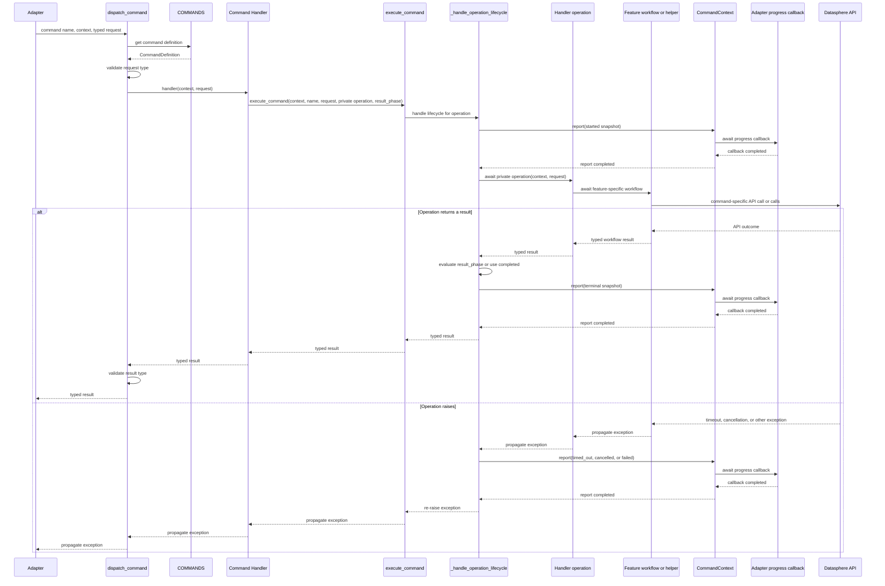
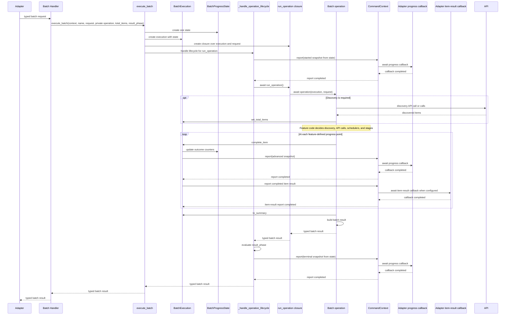
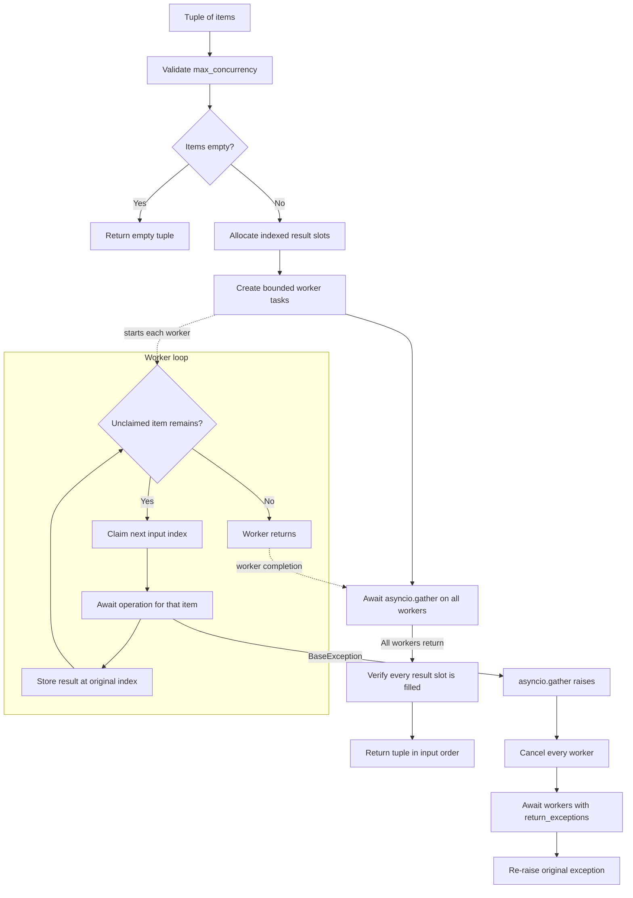
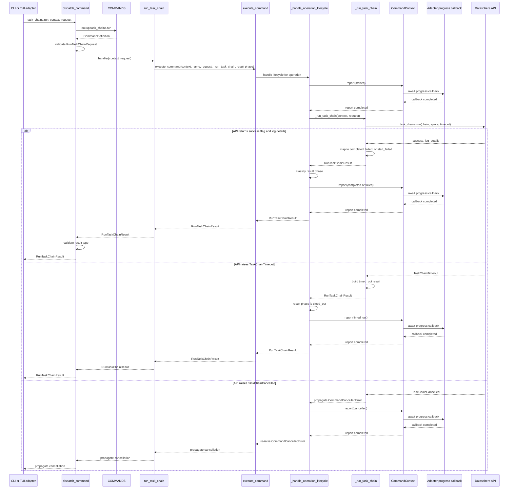
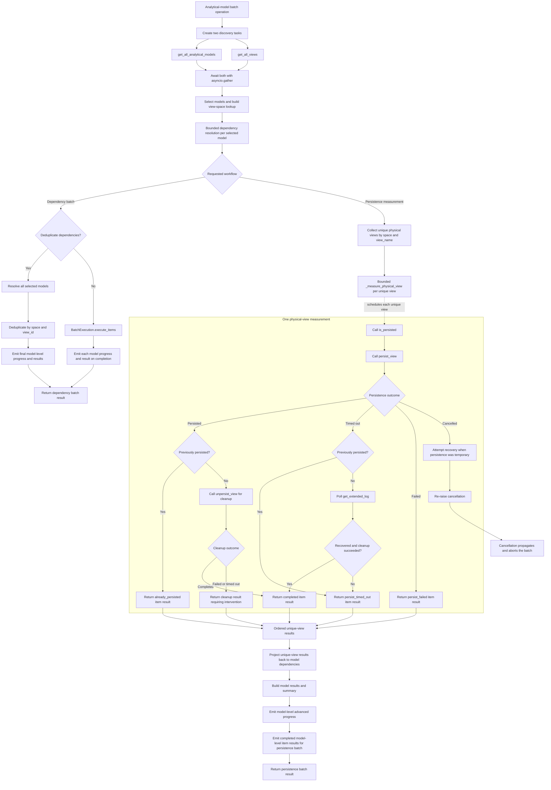

# Datasphere-Core Execution Architecture

This document describes the current execution architecture of
`datasphere-core`. It focuses on the paths from an adapter into a typed Core
command, the handling of progress and batch-item results, bounded concurrency,
and the feature-specific workflows.

The document describes the current implementation. Planned MCP integration
and future execution refactors are marked explicitly.

## Scope and Responsibilities

`datasphere-core` is the presentation-independent command layer shared by the
CLI and the future MCP adapter.

Core owns:

- typed command requests and results;
- command metadata and the command registry;
- API client calls through `DatasphereClient`;
- single-command and batch-command lifecycle reporting;
- bounded concurrency for independent operations;
- result summaries and domain status classification;
- local session and credential handling;
- completed batch-item result delivery through `CommandContext`.

Core does not own:

- Textual or Rich UI state;
- CSV and JSON file formats;
- terminal rendering;
- MCP protocol objects;
- CLI process exit handling;
- presentation-specific progress bars.

## External Entry Points

### Direct CLI command

The console scripts target `datasphere_cli.cli:main`.

With arguments, the CLI routes through `datasphere_cli.cli.commands.run`.
The currently supported direct command is:

```text
datasphere task-chains run CHAIN --space SPACE
```

The direct command path is:

```text
cli.main(argv)
  -> cli.commands.run(argv)
  -> build RunTaskChainRequest
  -> create DatasphereSession
  -> authenticate
  -> actions.dispatch.dispatch_command(...)
  -> Core command handler
  -> render text or JSON
  -> return process exit code
```

The direct command exits successfully only when the task-chain result has
status `completed`. JSON output is written to `stdout`; errors are written to
`stderr`.

### TUI actions

When no command-line arguments are supplied, the CLI opens the Textual TUI.
TUI actions in `src/datasphere_cli/actions/` translate file-backed or screen
state into Core request models and call the shared dispatcher.

The dispatcher path is:

```text
TUI action
  -> build typed Core request
  -> actions.dispatch.dispatch_command
  -> COMMANDS[command_name]
  -> validate request type
  -> call CommandDefinition.handler
  -> validate result type
  -> adapt result for the TUI or file output
```

The TUI currently uses these batch commands:

| TUI capability | Core command |
| --- | --- |
| Export model view dependencies | `analytical_models.get_view_dependencies_batch` |
| Measure model view persistence | `analytical_models.measure_view_persistence_batch` |
| Configure remote-table statistics | `remote_tables.configure_statistics_batch` |
| Refresh remote-table statistics | `remote_tables.refresh_statistics_batch` |
| Run task chains from a file | `task_chains.run_batch` |
| Export persistence candidates | `views.find_persistence_candidates_batch` |
| Export matching attributes | `views.find_attribute_matches_batch` |
| Create partitioning | `views.create_partitioning_batch` |
| Delete partitioning | `views.delete_partitioning_batch` |
| Persist views | `views.persist_batch` |
| Unpersist views | `views.unpersist_batch` |
| Lock partitions | `views.lock_partitions_batch` |
| Unlock partitions | `views.unlock_partitions_batch` |

### MCP

The current MCP adapter is not aligned with the current Core package. It still
imports obsolete task-chain names such as `TASKCHAIN_START_COMMAND`,
`StartTaskChainRequest`, and `start_task_chain`.

The current Core names are:

```text
TASK_CHAINS_RUN_COMMAND
RunTaskChainRequest
run_task_chain
RunTaskChainResult
```

The current MCP source is therefore not a working registry-driven entrypoint.
It manually wires an old task-chain tool instead of dispatching through
`COMMANDS`. Only `task_chains.run` is currently marked with
`expose_to_mcp=True`; all other registered commands are deliberately hidden
from MCP.

## Command Registry

`datasphere_core.registry` imports command definition tuples from the four
feature modules and builds the immutable `COMMANDS` mapping through
`build_command_registry`.

Each `CommandDefinition` contains:

- command name;
- request type;
- result type;
- handler;
- neutral command description;
- default timeout;
- maximum timeout;
- read-only flag;
- destructive flag;
- idempotent flag;
- `expose_to_mcp` flag.

The registry rejects duplicate command names and is exposed as a
`MappingProxyType`.

The current registry contains 26 commands.

### Analytical-model commands

```text
analytical_models.get_view_dependencies
analytical_models.get_view_dependencies_batch
analytical_models.measure_view_persistence
analytical_models.measure_view_persistence_batch
```

### Remote-table commands

```text
remote_tables.configure_statistics
remote_tables.configure_statistics_batch
remote_tables.refresh_statistics
remote_tables.refresh_statistics_batch
```

### Task-chain commands

```text
task_chains.run
task_chains.run_batch
```

### View commands

```text
views.find_persistence_candidates
views.find_persistence_candidates_batch
views.find_attribute_matches
views.find_attribute_matches_batch
views.create_partitioning
views.create_partitioning_batch
views.delete_partitioning
views.delete_partitioning_batch
views.persist
views.persist_batch
views.unpersist
views.unpersist_batch
views.lock_partitions
views.lock_partitions_batch
views.unlock_partitions
views.unlock_partitions_batch
```

There is currently no Core-level `execute_registered_command` function. The
CLI dispatcher performs registry lookup and type validation itself. The MCP
adapter does not currently use the registry.

## CommandContext

`CommandContext` is a frozen, slotted dataclass containing the runtime
dependencies needed by handlers:

```python
client: DatasphereClient
progress_callback: ProgressCallback | None
batch_item_result_callback: BatchItemResultCallback | None
```

The callback types are:

```python
type ProgressCallback = Callable[
    [CommandProgress],
    Awaitable[None],
]

type BatchItemResultCallback = Callable[
    [BatchItemResult],
    Awaitable[None],
]
```

`CommandContext.report` forwards a progress snapshot when a progress callback
is configured. `CommandContext.report_batch_item_result` forwards a completed
batch item when a result callback is configured. Both methods are no-ops when
their callback is absent.

The context does not contain UI objects, file paths, MCP objects, or process
exit logic.

## Single-Command Execution

The public single-command wrapper is:

```python
async def execute_command(
    context: CommandContext,
    command: str,
    request: RequestT,
    operation: CommandOperation[RequestT, ResultT],
    *,
    result_phase: Callable[[ResultT], CommandProgressPhase] | None = None,
) -> ResultT:
    ...
```

`execute_command` does not create or receive a batch progress state.

The path is:

```text
execute_command
  -> _handle_operation_lifecycle
  -> report started
  -> await operation(context, request)
  -> evaluate result_phase, if configured
  -> report terminal phase
  -> return typed result
```

### Single-command success

```text
started
operation returns a result
result_phase(result), or completed by default
terminal progress
typed result returned
```

### Single-command timeout

When the operation raises `CommandTimeoutError`:

```text
started
timed_out with error message
CommandTimeoutError re-raised
```

The wrapper itself does not enforce a timeout. API calls or command-specific
recovery code are responsible for producing `CommandTimeoutError`.

### Single-command cancellation

When the operation raises `asyncio.CancelledError`:

```text
started
cancelled
CancelledError re-raised
```

Feature-specific API cancellation exceptions may first be converted into
`CommandCancelledError`.

### Unexpected single-command exception

Any other exception produces:

```text
started
failed
exception re-raised
```

### Single-command sequence



The exception branch covers exceptions raised while awaiting `operation`.
Reporting `started`, evaluating `result_phase`, and reporting the terminal
snapshot happen outside that `try` block. An exception from one of those
steps propagates without an additional lifecycle event.

## Batch-Command Execution

The public batch wrapper is:

```python
async def execute_batch(
    context: CommandContext,
    command: str,
    request: RequestT,
    operation: BatchOperation[RequestT, ResultT],
    *,
    total_items: int | None = None,
    result_phase: Callable[[ResultT], CommandProgressPhase] | None = None,
) -> ResultT:
    ...
```

`execute_batch` creates exactly one `BatchProgressState` and one
`BatchExecution` for the batch. The private batch operation receives the
execution object and the typed request.

```text
execute_batch
  -> create BatchProgressState
  -> create BatchExecution
  -> create run_operation closure
  -> _handle_operation_lifecycle
      -> report started through CommandContext
      -> await run_operation()
          -> await operation(execution, request)
      -> evaluate result_phase(result)
      -> report terminal phase through CommandContext
  -> return typed batch result
```

The batch operation remains responsible for:

- discovery;
- status classification;
- feature-specific result construction;
- feature-specific cleanup.

`BatchExecution` centralizes:

- bounded item execution through `execute_items`;
- synchronized counter updates, `advanced` progress events, and item-result
  callbacks through `complete_item`;
- discovered total updates through `set_total_items`;
- `BatchSummary` construction through `to_summary`.

### Batch progress state

`BatchProgressState` contains:

```text
total_items
succeeded
failed
skipped
timed_out
```

`completed_items` is calculated as the sum of the four outcome counters.
Feature-specific result statuses are normalized to `BatchItemFinalStatus`
values:

```text
succeeded
failed
skipped
timed_out
```

`BatchProgressState.record` updates the matching counter.
`BatchProgressState.to_summary` creates the terminal `BatchSummary` from the
recorded outcomes.

For discovery-based batches, `total_items` can initially be `None` and is
updated by the operation after discovery. No separate discovery phase exists.

### Batch lifecycle

The normal batch event sequence is:

```text
started
advanced and an optional item-result callback for each completed item
completed | failed | timed_out | cancelled
```

Unexpected exceptions abort the whole batch. They do not produce a partial
batch result.

### Batch sequence



## Bounded Concurrency

`execute_with_concurrency_limit` is a lower-level scheduler. It is separate
from lifecycle reporting and from `execute_batch`.

Flat command batches normally call `BatchExecution.execute_items`, which
indexes the typed requests, invokes a private item operation with the shared
`CommandContext`, classifies and reports each result, and delegates scheduling
to `execute_with_concurrency_limit`.

```python
async def execute_with_concurrency_limit(
    items: tuple[InputT, ...],
    operation: Callable[[InputT], Awaitable[OutputT]],
    *,
    max_concurrency: int,
) -> tuple[OutputT, ...]:
    ...
```

The function:

1. Validates `max_concurrency` between 1 and 32.
2. Returns immediately for an empty input tuple.
3. Creates at most `min(max_concurrency, len(items))` workers.
4. Gives each worker the next unclaimed input index.
5. Stores each result at its original input index.
6. Returns a tuple in input order.
7. Cancels and awaits all workers on `BaseException`.

The function does not:

- report progress;
- create `BatchProgressState`;
- classify domain statuses;
- build `BatchSummary`;
- convert exceptions into typed item results;
- perform discovery;
- provide partial results after an unexpected exception.

The final result order is deterministic. Progress event order is generally
completion order.

### Concurrency flow



## Flat View Batch Paths

Each view batch has a public lifecycle wrapper and a private batch operation:

```text
views.find_persistence_candidates_batch
views.find_attribute_matches_batch
views.create_partitioning_batch
views.delete_partitioning_batch
views.persist_batch
views.unpersist_batch
views.lock_partitions_batch
views.unlock_partitions_batch
```

The shared pattern is:

```text
public view batch handler
  -> execute_batch(request, private batch operation)
  -> private batch operation
  -> use explicit requests or discover requests
  -> BatchExecution.execute_items
      -> execute one item
      -> classify status
      -> update synchronized BatchProgressState
      -> report synchronized advanced progress
  -> BatchExecution.to_summary
  -> build feature-specific batch result
```

### View discovery

Persistence-candidate discovery calls:

```text
client.views.get_all_views()
client.views.analyze_view(view, space, timeout_seconds=...)
```

Non-empty analyzer entities produce candidates. Empty analyzer results are
currently treated as a failed item. API timeouts become typed timeout results.

Attribute matching calls:

```text
client.views.get_all_views()
client.views.get_view_attributes(view_id, view, space)
```

Matching honors the requested case-sensitivity. Empty attribute responses are
currently treated as failed results.

### View mutation operations

| Command | API operation | Typical statuses |
| --- | --- | --- |
| `views.create_partitioning` | `views.create_partitioning` | `created`, `already_exists`, `invalid_column`, `failed` |
| `views.delete_partitioning` | `views.delete_partitioning` | `deleted`, `failed` |
| `views.persist` | `views.persist_view` | `completed`, `start_failed`, `failed`, `timed_out` |
| `views.unpersist` | `views.unpersist_view` | `completed`, `already_absent`, `start_failed`, `failed`, `timed_out` |
| `views.lock_partitions` | `views.lock_partitions` | `locked`, `no_partitions`, `failed` |
| `views.unlock_partitions` | `views.unlock_partitions` | `unlocked`, `no_partitions`, `failed` |

View batch result order follows request or discovery order. Advanced progress
events occur when individual operations complete and may therefore arrive in a
different order.

Partition creation uses `range(start_year, end_year)`, so `end_year` is
exclusive.

## Remote-Table Batch Paths

Remote-table batches use `BatchExecution.execute_items` after one shared
metadata discovery call.

The commands are:

```text
remote_tables.configure_statistics_batch
remote_tables.refresh_statistics_batch
```

Both first call:

```text
client.remote_tables.get_all_tables(space)
```

Explicit table selections retain caller order. `tables=None` selects all table
names in sorted order.

### Configure statistics

For each table, the handler decides between:

```text
missing metadata
  -> failed
statistics unsupported
  -> unsupported
unsupported requested type
  -> unsupported_type
requested type already configured
  -> already_configured
no statistics configured
  -> create_statistics(...)
different type configured
  -> update_statistics(...)
```

Successful statuses are `created`, `updated`, `already_configured`, and
`already_exists`. `unsupported` and `unsupported_type` are skipped statuses.

### Refresh statistics

For each table, the handler decides between:

```text
missing metadata
  -> table_not_found
statistics unsupported
  -> unsupported
no statistics configured
  -> no_statistics
statistics configured
  -> refresh_statistics(...)
```

`refresh_statistics` returning `True` produces `refreshed`; `False` produces
`failed`. `no_statistics` and `unsupported` are skipped statuses.

The metadata lookup is sequential. The per-table mutation or refresh phase is
bounded by the request's `max_concurrency`.

Remote-table batches do not produce per-item timeout statuses.

## Task-Chain Paths

### Single task chain

```text
run_task_chain
  -> execute_command("task_chains.run")
  -> _run_task_chain
  -> client.task_chains.run(chain, space, timeout_seconds)
  -> normalize API result
  -> report terminal lifecycle
```

Status mapping:

| API condition | Core status |
| --- | --- |
| `success=True` | `completed` |
| `success=False` with log details | `failed` |
| `success=False` without log details | `start_failed` |
| `TaskChainTimeout` | `timed_out` |
| `TaskChainCancelled` | `CommandCancelledError` |

### Task-chain batch

```text
run_task_chain_batch
  -> execute_batch
  -> _run_task_chain_batch
  -> BatchExecution.execute_items
  -> _run_task_chain for each request
  -> synchronized progress updates
  -> build RunTaskChainBatchResult
```

`completed` is successful, `failed` and `start_failed` are failed, and
`timed_out` is timed out. Task-chain batches do not produce skipped items.

### Task-chain sequence



## Analytical-Model Paths

Analytical-model workflows are multi-stage and should not be treated as a
simple flat item batch.

### Dependency discovery and resolution

Dependency discovery and resolution are split into these stages:

```text
_discover_dependency_inputs
  -> start get_all_analytical_models and get_all_views concurrently
  -> select explicit models or filter discovered models by space
  -> build view-ID-to-space lookup
_resolve_dependency_results
  -> resolve selected model dependencies with bounded concurrency
  -> return model results in selection order
```

`_load_dependency_results` combines discovery and resolution for single-model
commands and staged persistence workflows. The dependency batch uses the two
stages separately so it can report each model immediately when
`deduplicate_views` is disabled.

The API calls are:

```text
client.analytical_models.get_all_analytical_models()
client.views.get_all_views()
client.analytical_models.get_views_for_analytical_model(model_id)
```

Resolved dependencies have status `resolved`. Missing view spaces have status
`not_found`.

Model-level dependency statuses are:

```text
completed
dependency_not_found
analytical_model_not_found
```

The helper methods involved are:

```text
_select_analytical_models
_discover_dependency_inputs
_resolve_dependency_input
_resolve_dependency_request
_resolve_dependency_results
_get_resolved_dependencies
_load_dependency_results
_deduplicate_dependencies
_dependency_outcome
_progress_phase_for_dependencies
```

Explicit model references retain input order. Discovered models retain API
order. Missing explicit models remain at their original positions.

### Dependency deduplication

When requested, `_deduplicate_dependencies` removes repeated resolved views
using the `(space, view_id)` key. Unresolved dependencies remain associated
with every source model.

### Persistence measurement

The measurement path is:

```text
load model dependencies
  -> find unique physical dependencies by (space, view_name)
  -> measure each unique physical view with bounded concurrency
  -> project measurements back to every model dependency
  -> calculate model-level status and summary
  -> report model-level progress
  -> report completed model-level item results
```

The physical-view calls are:

```text
client.views.is_persisted(view, space)
client.views.persist_view(view, space, timeout_seconds=...)
client.views.unpersist_view(view, space, timeout_seconds=...)
```

Previously persisted views are not unpersisted. Newly persisted views are
cleaned up after measurement.

The main helper methods are:

```text
_detail_string
_log_id
_runtime_seconds
_measure_item
_run_cleanup
_recover_persistence_and_cleanup
_measure_physical_view
_missing_dependency_measure_item
_measure_status
_measure_dependency_results
_persistence_outcome
_progress_phase_for_measurement
```

### Timeout recovery and cleanup

When persistence times out, the handler may poll:

```text
client.views.get_extended_log(log_id, space)
```

Polling occurs until completion, another terminal status, timeout, or
cancellation. Cleanup is shielded and awaited where necessary so temporary
persistence is not left unattended.

Persistence item statuses are:

```text
completed
already_persisted
dependency_not_found
persist_failed
persist_timed_out
cleanup_failed
cleanup_timed_out
```

Model-level statuses are:

```text
completed
failed
timed_out
analytical_model_not_found
```

Model-level status precedence is:

1. Any persistence or cleanup timeout produces `timed_out`.
2. Any other non-success item produces `failed`.
3. Otherwise the model is `completed`.

### Analytical-model flowchart

The diagram below shows the two batch workflows. The corresponding single
commands reuse the dependency-resolution and physical-view measurement stages,
but they do not build a `BatchSummary`, emit `advanced` model progress, or emit
batch-item results.



### Analytical-model progress

Dependency and physical-view API calls run concurrently. Dependency batches
without deduplication emit model-level progress and item results as each model
finishes. With deduplication enabled, all model results are collected first so
the final dependency lists can be deduplicated before reporting. Persistence
batches remain staged and report only after physical-view projection.

## Progress and Batch-Item Results

`CommandProgress.phase` uses the `CommandProgressPhase` `StrEnum` with these
values:

```text
started
advanced
completed
failed
timed_out
cancelled
```

Single commands normally emit:

```text
started
completed | failed | timed_out | cancelled
```

Flat batches normally emit:

```text
started
advanced repeated for completed items
completed | failed | timed_out | cancelled
```

Advanced snapshots contain the current counters and may include
`item_index`. Result order remains input order even when progress events arrive
in completion order.

Every batch reports one `BatchItemResult` for each completed logical item when
the caller configures `batch_item_result_callback`. For flat concurrent batches
and dependency batches without deduplication, item callbacks occur in
completion order. Their `item_index` values allow the caller to restore input
order. Dependency batches with deduplication report final model-level results
after all dependency processing and deduplication. Persistence measurement
reports after physical-view projection.

After all item-result callbacks complete, the batch emits its terminal progress
event and returns the complete typed batch result in input or discovery order.

## Results and Summaries

All Core request and result models are frozen, slotted dataclasses.

`BatchSummary` contains:

```text
total
succeeded
failed
skipped
timed_out
```

The producing commands maintain this relationship:

```text
succeeded + failed + skipped + timed_out == total
```

`BatchSummary` itself does not perform runtime validation. The
feature-specific batch result models continue to verify that their summary
matches their item statuses.

`CommandProgress` carries lifecycle phase, optional batch totals, optional
outcome counters, and an optional item index.

`BatchItemResult` carries the command name, item index, total item count, and
the command-specific result for incremental persistence.

Each feature-specific batch result validates that its `BatchSummary` matches
the statuses of its item results.

## Ordering and Concurrency Guarantees

Guaranteed:

- final batch result order equals request or discovery order;
- explicit requests retain caller order;
- discovered views retain API order;
- discovered remote tables are sorted;
- discovered analytical models retain API order;
- at most `max_concurrency` item operations run in one scheduler invocation;
- accepted concurrency is between 1 and 32;
- item counter updates, progress callbacks, and item-result callbacks are
  serialized by a lock;
- a configured item-result callback receives every completed logical item;
- summaries are derived from final typed statuses.

Not guaranteed:

- progress event order equals input order;
- dependency-batch callback order is completion order when deduplication is
  disabled, but selection order after deduplication;
- API start order is deterministic after workers begin;
- every internal analytical stage emits progress;
- a partial batch result exists after an unexpected exception;
- Core enforces command-definition timeout metadata itself.

## Error and Cancellation Paths

Expected domain outcomes are usually represented as typed statuses such as:

```text
failed
start_failed
unsupported
unsupported_type
already_absent
already_exists
no_partitions
analytical_model_not_found
```

Unexpected exceptions abort the current operation, report `failed`, cancel
remaining bounded-concurrency workers, and are re-raised.

Cancellation is propagated after reporting `cancelled`. Feature-specific
cleanup may delay propagation to avoid leaving temporary persistence behind.

API cancellation normalization is not fully uniform across features. Views
and task chains generally convert API cancellation into
`CommandCancelledError`; analytical persistence retains special cleanup logic.

Progress callback failures are awaited as part of the command and can abort
the operation.

## CLI File Adapters and Batch-Item Results

CLI file adapters translate file records into typed Core requests and typed Core
results back into CSV or JSON.

Typical paths are:

```text
CSV or screen state
  -> typed request model
  -> dispatch_command
  -> Core handler
  -> typed result model
  -> CSV or JSON adapter
```

The analytical persistence adapter additionally installs a batch-item result
callback with `dataclasses.replace(context, batch_item_result_callback=...)`.
It stores completed model results by index, writes partial JSON, and writes the
complete final JSON after successful completion.

Other adapters currently write final results only.

## Method Index

### Execution methods

| Method | Responsibility |
| --- | --- |
| `execute_command` | Lifecycle wrapper for one logical command |
| `execute_batch` | Lifecycle wrapper and state owner for one batch command |
| `_handle_operation_lifecycle` | Shared lifecycle implementation for single and batch wrappers |
| `_lifecycle_progress` | Creates a `CommandProgress` snapshot |
| `batch_result_phase` | Maps a `BatchSummary` to a terminal phase |
| `BatchProgressState.record` | Records one normalized `BatchItemFinalStatus` |
| `BatchProgressState.to_summary` | Creates a summary from recorded outcomes |
| `BatchExecution.set_total_items` | Updates the discovered batch size |
| `BatchExecution.complete_item` | Records an item and reports its progress and result |
| `BatchExecution.execute_items` | Runs and reports independent typed items |
| `BatchExecution.to_summary` | Creates the batch summary |
| `execute_with_concurrency_limit` | Runs independent items with bounded concurrency and stable result order |

### Context methods

| Method | Responsibility |
| --- | --- |
| `CommandContext.report` | Forward progress to the configured callback |
| `CommandContext.report_batch_item_result` | Forward a completed item result to the configured callback |

### Registry methods

| Method | Responsibility |
| --- | --- |
| `CommandDefinition.__post_init__` | Validate command metadata |
| `build_command_registry` | Build an immutable registry and reject duplicates |
| `dispatch_command` | CLI-side lookup, request validation, handler invocation, and result validation |

### Analytical-model methods

| Method | Responsibility |
| --- | --- |
| `_select_analytical_models` | Select explicit or discovered models |
| `_discover_dependency_inputs` | Discover models and prepare view-space lookup |
| `_resolve_dependency_input` | Resolve one prepared model with a command context |
| `_resolve_dependency_results` | Resolve prepared models with bounded concurrency |
| `_get_resolved_dependencies` | Resolve dependencies for one model |
| `_load_dependency_results` | Discover and resolve models with bounded concurrency |
| `_deduplicate_dependencies` | Remove repeated resolved dependencies |
| `_dependency_outcome` | Classify one dependency result |
| `_measure_physical_view` | Measure one physical view and clean up temporary persistence |
| `_recover_persistence_and_cleanup` | Recover a timed-out persistence operation and clean up |
| `_measure_dependency_results` | Measure unique physical views and project results back to models |
| `_persistence_outcome` | Classify one persistence result |
| `_get_analytical_model_view_dependencies` | Resolve one model without lifecycle reporting |
| `_get_analytical_model_view_dependencies_batch` | Resolve a model batch using `BatchExecution` |
| `_measure_analytical_model_view_persistence` | Measure one model without lifecycle reporting |
| `_measure_analytical_model_view_persistence_batch` | Measure a model batch using `BatchExecution` |
| `get_analytical_model_view_dependencies` | Resolve one model |
| `get_analytical_model_view_dependencies_batch` | Resolve multiple models |
| `measure_analytical_model_view_persistence` | Measure one model |
| `measure_analytical_model_view_persistence_batch` | Measure multiple models |

### Remote-table methods

| Method | Responsibility |
| --- | --- |
| `_configure_remote_table_statistics` | Configure statistics for one table |
| `_refresh_remote_table_statistics` | Refresh statistics for one table |
| `_configure_outcome` | Classify a configuration result |
| `_refresh_outcome` | Classify a refresh result |
| `_configure_remote_table_statistics_batch` | Configure a table batch using `BatchExecution` |
| `_refresh_remote_table_statistics_batch` | Refresh a table batch using `BatchExecution` |
| `configure_remote_table_statistics` | Configure one table |
| `configure_remote_table_statistics_batch` | Configure multiple tables |
| `refresh_remote_table_statistics` | Refresh one table |
| `refresh_remote_table_statistics_batch` | Refresh multiple tables |

### Task-chain methods

| Method | Responsibility |
| --- | --- |
| `_get_log_status` | Normalize the SAP status field |
| `_get_log_id` | Normalize the log identifier |
| `_get_runtime_seconds` | Normalize runtime details |
| `_run_task_chain` | Run and normalize one task chain |
| `_map_result_to_command_progress_phase` | Map one task-chain result to a lifecycle phase |
| `_map_result_to_batch_item_final_status` | Classify one task-chain batch result |
| `_run_task_chain_batch` | Run a task-chain batch using `BatchExecution` |
| `run_task_chain` | Run one task chain |
| `run_task_chain_batch` | Run multiple task chains with bounded concurrency |

### View methods

| Method | Responsibility |
| --- | --- |
| `_candidate_from_entity` | Convert analyzer data to a candidate |
| `_find_view_persistence_candidates` | Analyze one view for candidates |
| `_find_view_attribute_matches` | Find attributes for one view |
| `_create_view_partitioning` | Create partitions for one view |
| `_delete_view_partitioning` | Delete partitions for one view |
| `_persist_view` | Persist one view |
| `_unpersist_view` | Unpersist one view |
| `_lock_view_partitions` | Lock partitions for one view |
| `_unlock_view_partitions` | Unlock partitions for one view |
| `_find_view_persistence_candidates_batch` | Analyze a view batch using `BatchExecution` |
| `_find_view_attribute_matches_batch` | Search an attribute batch using `BatchExecution` |
| `_create_view_partitioning_batch` | Create partitioning using `BatchExecution` |
| `_delete_view_partitioning_batch` | Delete partitioning using `BatchExecution` |
| `_persist_view_batch` | Persist views using `BatchExecution` |
| `_unpersist_view_batch` | Unpersist views using `BatchExecution` |
| `_lock_view_partitions_batch` | Lock partitions using `BatchExecution` |
| `_unlock_view_partitions_batch` | Unlock partitions using `BatchExecution` |
| `find_view_persistence_candidates` | Find candidates for one view |
| `find_view_persistence_candidates_batch` | Find candidates for multiple views |
| `find_view_attribute_matches` | Find attributes for one view |
| `find_view_attribute_matches_batch` | Find attributes for multiple views |
| `create_view_partitioning` | Create partitions for one view |
| `create_view_partitioning_batch` | Create partitions for multiple views |
| `delete_view_partitioning` | Delete partitions for one view |
| `delete_view_partitioning_batch` | Delete partitions for multiple views |
| `persist_view` | Persist one view |
| `persist_view_batch` | Persist multiple views |
| `unpersist_view` | Unpersist one view |
| `unpersist_view_batch` | Unpersist multiple views |
| `lock_view_partitions` | Lock one view's partitions |
| `lock_view_partitions_batch` | Lock multiple views' partitions |
| `unlock_view_partitions` | Unlock one view's partitions |
| `unlock_view_partitions_batch` | Unlock multiple views' partitions |

## Current Caveats

The following points are implementation facts or open design issues rather
than intended guarantees:

1. The MCP adapter is stale and does not currently dispatch through `COMMANDS`.
2. Core has no canonical registry execution function for all adapters.
3. Command metadata timeouts are not enforced centrally by Core.
4. Remote-table request models do not carry an item timeout.
5. Unexpected item exceptions abort an entire batch instead of producing a
   partial result.
6. Analytical-model progress is model-level, not physical-view-level.
7. Analytical persistence batch-item results are model-level and emitted after
   projection.
8. Dependency deduplication uses `(space, view_id)` while persistence
   measurement uses `(space, view_name)`.
9. Some empty API responses are deliberately classified as failures.
10. The direct CLI exposes only the task-chain single command; the broader
    command set is reached through TUI/file adapters.

The architecture should be changed only after these behavior contracts are
covered by tests and an explicit decision is made about progress and
batch-item result granularity.
